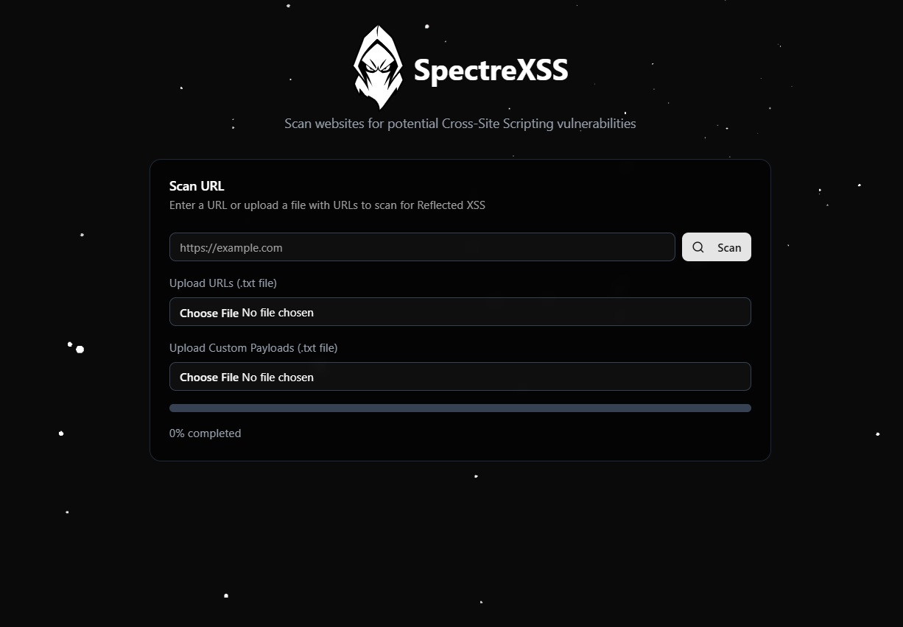

#



SpectreXSS is a modern web application designed to scan websites for potential Cross-Site Scripting (XSS) vulnerabilities. Built with cutting-edge technologies, it provides a user-friendly interface for security professionals and developers to identify and mitigate Reflected XSS risks.

## 🛠️ Technologies Used

- **Frontend Framework**: [Astro](https://astro.build/) - A modern static site generator that allows for fast, optimized websites.
- **Styling**: [Tailwind CSS](https://tailwindcss.com/) - A utility-first CSS framework for rapid UI development.
- **State Management**: React Hooks (`useState`, `useEffect`) - For managing component state and side effects.
- **API Handling**: Fetch API - For making HTTP requests to the backend.
- **Backend**: Astro API Routes - For handling server-side logic and XSS scanning.
- **Toast Notifications**: [Sonner](https://github.com/emilkowalski/sonner) - A lightweight toast notification library.
- **Radix UI**: [Radix UI](https://www.radix-ui.com/) - Unstyled, accessible UI primitives for building design systems.
- **JavaScript Runtime**: [Deno](https://deno.land/) - A secure runtime for JavaScript and TypeScript, used under the hood by Astro.
- **React**: - [JavaSript library](https://reactjs.org/) for building user interfaces, integrated with Astro for dynamic components.
- **React Bits**: [Library](https://www.reactbits.dev/) with animated UI components.

## 🚀 Getting Started

### Prerequisites

- Node.js (v18 or higher)
- npm (v9 or higher)

### Installation

1. **Clone the repository**:
   ```bash
   git clone https://github.com/sp1r1tt/spectrexss.git
   cd spectrexss

2. **Install dependencies:**:
   ```bash
   npm install

3. **Running the Development Server:**:
   ```bash
   npm run dev

4. **Open your browser**:
   Visit http://localhost:4321 to see the application running.


### 🕵️‍♂️ How to Use SpectreXSS

Enter a URL: Input the URL of the website you want to scan in the provided field.

Upload Custom Payloads: Optionally, upload a .txt file containing custom XSS payloads.

Upload URLs: Optionally, upload a .txt file containing multiple URLs to scan.

Start Scanning: Click the "Scan" button to begin the vulnerability scan.

View Results: The results will be displayed in the "Vulnerabilities" tab, showing any detected XSS vulnerabilities along with details such as payloads and test URLs.


### 📂 Project Structure

```plaintext
/
├── public/                  # Static assets (favicon)
├── src/
│   ├── assets/              # Project assets (images, logos)
│   ├── components/          # React components
│   ├── layouts/             # Layout components
│   ├── lib/                 # Modules
│   ├── pages/               # Astro pages
│   ├── styles/              # Global styles and Tailwind configuration
├── astro.config.mjs         # Astro configuration
├── package.json             # Project dependencies and scripts
└── tsconfig.json            # TypeScript configuration
```


---

### 📜 License

This project is licensed under the BSD-3-Clause. See the LICENSE file for details.


## ⚠️ Warning

SpectreXSS is intended for **educational and ethical hacking purposes only**. It should only be used to test systems you **own** or have **explicit permission** to test. **Unauthorized use** of third-party websites or systems without consent is **illegal** and **unethical**.

---


Happy scanning! 🚀
